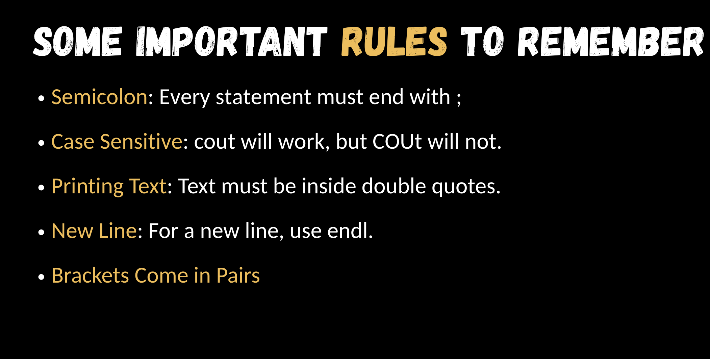

## Slides

_Introduction to C++ – Important Rules_

# Variables must be decalre before use.

# No Spaces in variable names.

# case sensitive marks =/ Marks.

# Name should be meaningful not x1/a1.

# Semicolon: Every statement must end with ;

# Case Sensitive: cout will work but COUT will not.

# Printing Text: Text must be inside double quotes.

# New Line: For a new line use endl;

# Brackets come in pairs.

