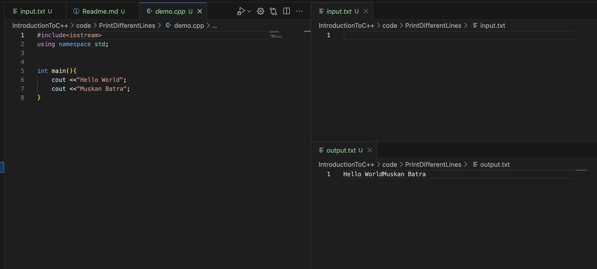
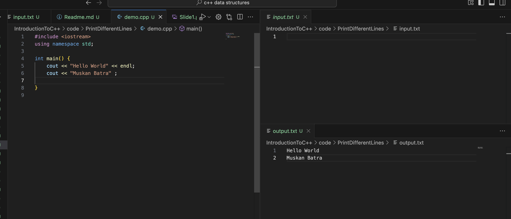
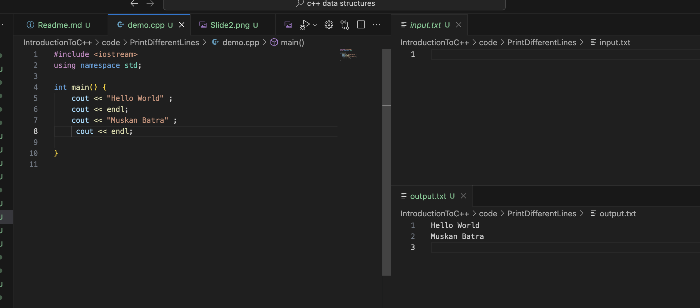
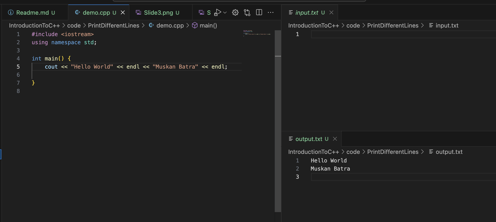

# PRINT IN DIFFERENT LINES

### In the code above you can see it is very difficult to print in two lines

### To print in different lines you can use endl

### I could write it like this also

### You can combine them also like this

